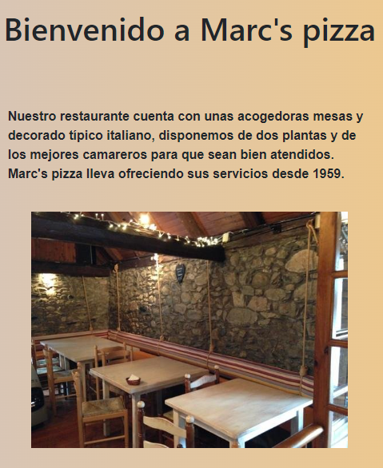

# Restaurant website


## Contents

 - [How to run](#How-to-run)
 - [Technologies used](#Technologies-used)
 - [About the project](#About-the-project)
  
--------------

## How to run

-----------------

Open a terminal and clone the repository with the following command:
```
    git clone https://github.com/marcormun/Proyecto-2
```
Run it with live server and done!

----------------------

## Contents of the website explained

-----------------

The webstie is totally responsive, there are some examples of it:
<br/>

Header.
<br/>


<br/>


<br/>

Home
<br/>


<br/>

Menu
<br/>


<br/>

Contact us
<br/>


## Technologies used

-------


